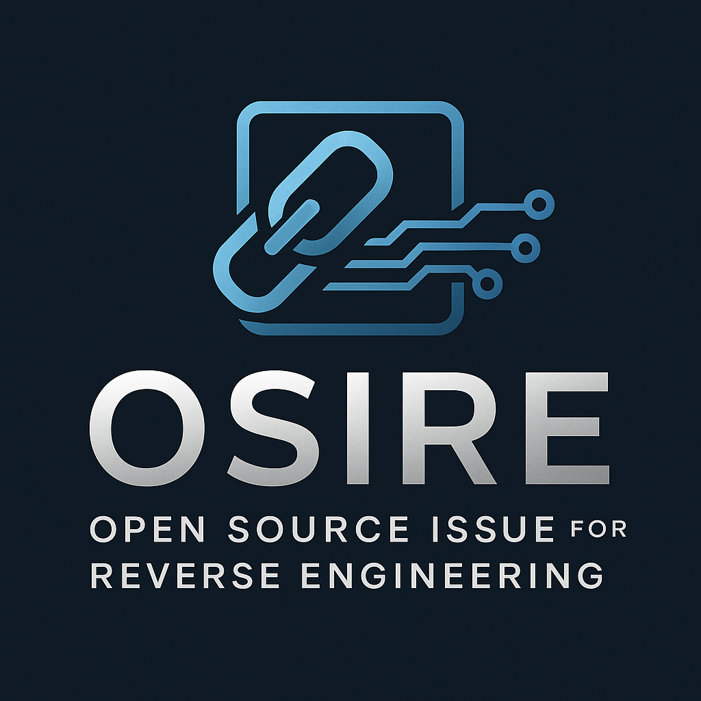
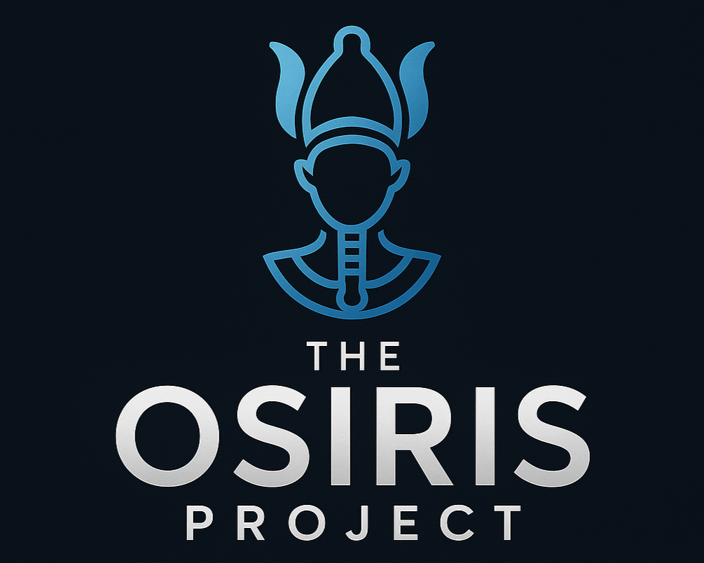

# The OSIRE Project


# 🔍 Reverse Engineering Open Source Issues

Welcome to the **Reverse-Engineered Issue Workflow** — a hands-on project designed to help students and new contributors learn how to analyze, recreate, and fix closed issues from real-world open source repositories.

This repo contains:

- ✅ A structured 5-step reverse-engineering process
- 📄 Log templates for pre- and post-fix documentation
- 🧠 Reflection and skill-tracking guidance
- 🛠️ Tools for mentor/instructor verification

---

## 📚 Purpose

This project is built to:

- Demystify how open source fixes are made
- Help students learn by rebuilding fixes from scratch
- Reinforce Git/GitHub workflows (branching, tagging, diffing)
- Encourage deeper reading of code, PRs, and file changes
- Teach reproducible, reflective coding practices

---

## 🧭 Project Workflow Overview

Each issue you reverse-engineer should follow the 5 documented steps:

| **Step** | **Summary** |
| --- | --- |
| [Step 1](/steps/step-1-select-and-prep.md) | Select and prepare an issue + PR to reverse-engineer |
| [Step 2](/steps/step-2-study-the-issue.md) | Study the original PR and tag the broken state |
| [Step 3](/steps/step-3-apply-the-fix.md) | Recreate and manually fix the issue yourself |
| [Step 4](/steps/step-4-wrap-it-up.md) | Compare your fix to the original and document your work |
| [Step 5](/steps/step-5-reflect-and-learn.md) | Reflect on what you learned and how you grew |

See individual Markdown files in the `/steps` directory for details.

---

## 📝 Documentation Templates

All work should be paired with:

- 📌 `RE Issue Pre-Fix Log` — created in Step 2
- 🛠 `RE Issue Post-Fix Log` — completed in Step 4

Templates are provided in the `/templates/` directory.

---

## 📁 File Structure

```
/steps/
  step-1-select-and-prep.md
  step-2-study-the-issue.md
  step-3-apply-the-fix.md
  step-4-wrap-it-up.md
  step-5-reflect-and-learn.md

templates/
  re-issue-pre-fix-log-template.md
  re-issue-post-fix-log-template.md

docs/
  README_Reverse_Engineering_Project.md
  osire-mentor-checklist.md
  //TODO Update files in doc
  Sample_Issue_Walkthrough/ (optional)

assets/
  osire-project-cover-image.png
```

---

## ✅ Requirements for Each Reverse-Engineered Issue

1. Use **a clean Git branch** for your fix
2. **Tag the broken state** before you begin your changes:
    
    ```
    git tag broken-version-#####
    ```
    
3. **Log your process** using both templates
4. **Compare your fix** to the original PR using:
    
    ```
    git diff broken-version-#####..your-branch-name
    ```
    
5. Submit your full documentation with all logs and branch references

---

## 🧠 Sample Issue Walkthrough (Optional)

To view a complete example, see the `/Sample_Issue_Walkthrough` directory. This includes:
// TODO Update sample issues
- A real issue and PR from freeCodeCamp
- A pre-fix log and post-fix log
- The diff between the broken and fixed branches
- Reflections and lessons learned

---

## 📬 Contact / Mentor Info

This project was created as part of an Honors Program initiative.

For questions, mentoring requests, or adaptation help, please contact:

**Nick Hanson:**

[nick@nickhanson.me](mailto:nick@nickhanson.me)

[ArchILLtech](https://github.com/ArchILLtect)

---

## 🚀 License

This project is open for educational use, remixing, and adaptation. Please credit the original author if reused in another course, bootcamp, or repo.

---

## 🚀 Future

OSIRE for now, OSIRIS for the spin-off courseware! :D


---

[RE Log for Step 1](/logs/re-log-for-step-1.md)

[RE Issue Pre-Fix Log Template](/logs/re-issue-pre-fix-log-template.md)

[RE Issue Post-Fix Log Template](/logs/re-issue-post-fix-log-template.md)

[Step 1: Select and Prep](/steps/step-1-select-and-prep.md)

[Step 2: Study the Issue](/steps/step-2-study-the-issue.md)

[Step 3: Apply the Fix](/steps/step-3-apply-the-fix.md)

[Step 4: Wrap it Up](/steps/step-4-wrap-it-up.md)

[Step 5: Reflect and Learn](/steps/step-5-reflect-and-learn.md)